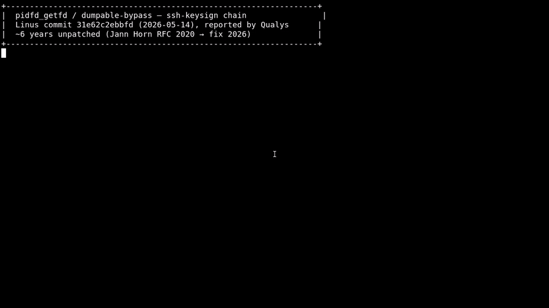

# ssh-keysign-pwn

> "It is a fearful thing to fall into the hands of the living God." — Hebrews 10:31

Read root-owned files as an unprivileged user. Pre-`31e62c2ebbfd` kernels (everything in stable as of 2026-05-14).



## The bug

`__ptrace_may_access()` skips the dumpable check when `task->mm == NULL`. `do_exit()` runs `exit_mm()` before `exit_files()` — no mm, fds still there. `pidfd_getfd(2)` succeeds in that window when the caller's uid matches the target's.

Reported by Qualys, fixed by Linus 2026-05-14. Jann Horn flagged the FD-theft shape in [October 2020](https://lore.kernel.org/all/20201016230915.1972840-1-jannh@google.com/). Six years.

## Targets

**`sshkeysign_pwn`** — pulls `/etc/ssh/ssh_host_{ecdsa,ed25519,rsa}_key`. `ssh-keysign.c` opens them (mode 0600) before `permanently_set_uid()`, then bails on `EnableSSHKeysign=no` with the fds still open. Same shape since 2002.

**`chage_pwn`** — pulls `/etc/shadow`. `chage -l <user>` calls `spw_open(O_RDONLY)` then `setreuid(ruid, ruid)`. Both args set means uid=euid=suid=ruid: full drop. Race the exit, lift the shadow fd, crack the root hash offline.

## Build and run

```sh
make
./sshkeysign_pwn          # host keys
./chage_pwn root          # /etc/shadow content
```

Either prints the file on stdout. Hits in 100–2000 spawns.

## Confirmed

Raspberry Pi OS Bookworm 6.12.75, Debian 13, Ubuntu 22.04 / 24.04 / 26.04, Arch, CentOS 9.

## Controlled-target PoC

`vuln_target.c` opens `/etc/shadow` then drops. `exploit_vuln_target.c` shows `EPERM` while it's alive and the steal post-`SIGKILL`.

```sh
sudo install -m 4755 vuln_target /usr/local/bin/vuln_target
./exploit_vuln_target /usr/local/bin/vuln_target
```
